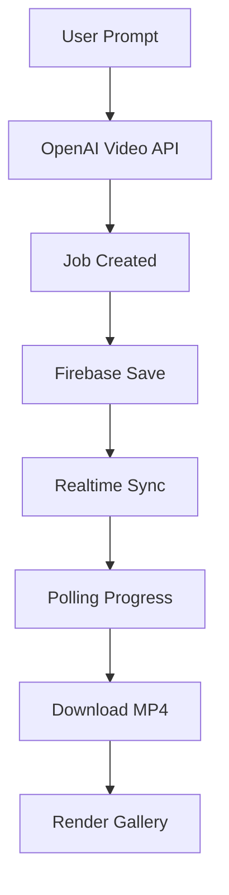

# 🎬 Sora 2 Studio

<p align="center">
  
  
  
  
</p>

<p align="center">
  Modern AI video generation dashboard powered by OpenAI Sora API + Firebase realtime sync.
</p>

---

# ✨ Features

- 🎥 AI video generation via OpenAI Video API
- 🔥 Firebase realtime synchronization
- 👥 Shared generation gallery
- 🖼 Reference image support
- 🎨 Style / First Frame modes
- ⚡ Live rendering progress
- 📦 Automatic history saving
- 🎬 Cinematic fullscreen viewer
- 📊 Auto cost calculation
- 🌙 Premium dark interface
- 🔔 Toast notifications
- 📱 Responsive UI

---

# 🖼 Preview

## Dashboard

```txt
✔ Realtime gallery
✔ Shared generations
✔ Live progress bars
✔ Reference image upload
✔ OpenAI integration
```

---

# 🚀 Quick Start

## 1. Clone repository

```bash
git clone https://github.com/YOUR_USERNAME/sora2-studio.git
cd sora2-studio
```

---

## 2. Setup Firebase

Create a Firebase project and enable:

- Firestore Database
- Web App

Insert your config:

```js
const firebaseConfig = {
  apiKey: "YOUR_KEY",
  authDomain: "YOUR_DOMAIN",
  projectId: "YOUR_PROJECT_ID",
  storageBucket: "YOUR_BUCKET",
  messagingSenderId: "YOUR_SENDER_ID",
  appId: "YOUR_APP_ID"
};
```

---

## 3. Firestore Rules

```js
rules_version = '2';

service cloud.firestore {
  match /databases/{database}/documents {
    match /{document=**} {
      allow read, write: if true;
    }
  }
}
```

---

## 4. Run project

Simply open:

```bash
sora2-studio.html
```

Or run local server:

```bash
npx serve
```

---

# 🔑 Usage

## Login

Enter your nickname.

It will be stored in:

```js
localStorage
```

---

## API Key

Paste your OpenAI API key:

```bash
sk-...
```

API key is NOT stored in Firebase.

---

# 🎥 Generation Flow



---

# 🖼 Reference Image

Supported formats:

- PNG
- JPG
- WEBP

Max size:

```txt
20 MB
```

Features:

- Auto resize
- Smart crop
- JPEG conversion
- Resolution matching

---

# 🔥 Firebase Realtime

All users instantly see:

- queued renders
- rendering progress
- completed videos
- failed jobs

Powered by:

```js
onSnapshot()
```

---

# 📊 Cost Calculation

```txt
sora-2       → $0.10/sec
sora-2-pro   → $0.30/sec
hi-res pro   → $0.50/sec
```

---

# 🎨 UI Features

## Gallery

- hover autoplay
- responsive grid
- realtime updates
- user badges
- reference badges

## Viewer

- fullscreen mode
- MP4 download
- prompt copy
- metadata panel

## Notifications

- success
- info
- error

---

# 📦 Firebase Document Example

```json
{
  "jobId": "vid_xxx",
  "prompt": "Cyberpunk city at night",
  "model": "sora-2-pro",
  "size": "1280x720",
  "seconds": 8,
  "status": "completed",
  "pct": 100,
  "user": "alex",
  "createdAt": 1710000000
}
```

---

# ⚠️ Important

## OpenAI Access

Your API account must support:

```txt
/v1/videos
```

---

## Recommended For Production

- Firebase Auth
- Backend proxy
- API key encryption
- Rate limiting
- Storage bucket
- CDN delivery

---

# 🛠 Tech Stack

| Tech | Usage |
|------|------|
| HTML5 | Structure |
| CSS3 | Styling |
| Vanilla JS | Logic |
| Firebase | Realtime DB |
| OpenAI API | Video generation |

---

# ❤️ Future Ideas

- 🎞 Multi-video generations
- ❤️ Likes system
- 💬 Comments
- 🧠 Prompt presets
- ☁ Cloud storage
- 📤 Public sharing
- 👤 User profiles
- 🎨 Theme customization

---

# 📄 License

MIT License

---

# ⭐ Star the repository

If you like this project — give it a star ⭐
